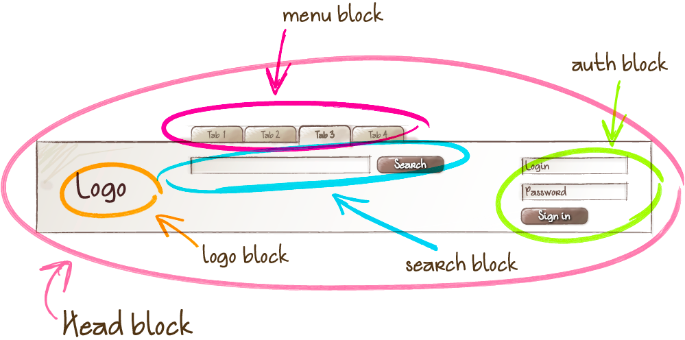
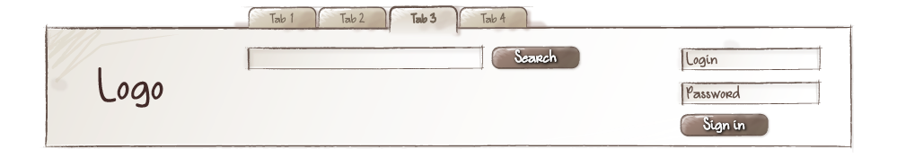

## Блок

Логически и функционально независимый компонент страницы, аналог компонента в Web Components. Блок инкапсулирует в себе поведение (JavaScript), шаблоны, стили (CSS) и другие технологии реализации. Независимость блоков обеспечивает возможность их повторного использования, а также удобство в разработке и поддержке проекта.

<strong>Возможности блоков</strong>

* Вложенная структура
* Свободное перемещение
* Повторное использование

### Вложенная структура

Блоки могут быть вложены в любые другие блоки. Например, блок `head` может включать логотип (`logo`), форму поиска (`search`) и блок авторизации (`auth`).

### Свободное перемещение

Блоки можно перемещать в пределах одной страницы, разных страниц или проектов. Независимая реализация блока позволяет изменять его положение на странице и обеспечивает корректную работу и внешний вид. Так, например, логотип и форму авторизации можно поменять местами. При этом вносить изменения в CSS или JavaScript-код блока не нужно.

### Повторное использование

В интерфейсе может одновременно присутствовать несколько экземпляров одного и того же блока.

