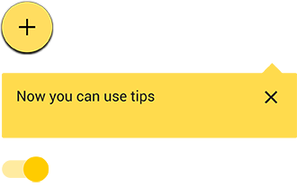

## Разделение кода на части

К CSS по БЭМ применяются основные принципы организации и хранения кода:

* разделение кода на отдельные части — логика работы каждого блока, его опциональных элементов и модификаторов описывается в отдельных файлах;
* CSS-файлы для каждого компонента хранятся в соответствии с правилами организации файловой структуры БЭМ-проекта.

Разделение кода на части и строгая организация файловой структуры проекта позволяет:

* облегчить навигацию по проекту;
* повторно использовать и переносить компоненты;
* работать с уровнями переопределения и использовать сборку.

<strong>Пример</strong> 

Блок `button` в файловой структуре проекта: 

```
button/                   # Директория блока button 
    _size 
        button_size_s.css # Реализация модификатора в технологии CSS 
    button.css            # Реализация блока button в технологии CSS
```

Такое разделение позволяет быстро находить нужные файлы.

### Принцип единственной ответственности {#part1}

Как и в объектно-ориентированном программировании, принцип единственной ответственности (англ. Single responsibility principle) в CSS по БЭМ означает, что каждая CSS-реализация должна иметь одну ответственность. 

<strong>Пример</stong>

HTML-реализация: 

```html
<header class="header"> 
  <button class="button header__button">...</button> 
</header>
```

CSS-реализация:

```css
.button { 
  font-family: Arial, sans-serif; 
  border: 1px solid black; 
  background: #fff; 
}
```

<strong>Ответственность:</strong> внешняя геометрия и позиционирование (зададим внешнюю геометрию и позиционирование для блока `button` через элемент `header__button`). 

Верно: 

```css
.header__button { 
  margin: 30px; 
  position: relative; 
}
```

Неверно: 

```css
.header__button { 
  font-family: Arial, sans-serif; 
  position: relative; 
  border: 1px solid black; 
  margin: 30px; 
}
```

Селекторы с одиночной ответственностью придают коду больше гибкости.

### Принцип открытости/закрытости {#part2}

Любой HTML-элемент страницы должен быть открыт для модификации, но закрыт для изменения. Разрабатывать новые CSS-реализации следует так, чтобы не пришлось менять уже существующие. 

<strong>Пример</strong> 

HTML-реализация: 

```html
<button class="button">...</button> 
<button class="button">...</button>
```

CSS-реализация: 

```css
.button { 
  font-family: Arial, sans-serif; 
  text-align: center; 
  font-size: 11px; 
  line-height: 20px; 
}
```

Предположим, что появилась необходимость изменить размер одной из кнопок. Следуя принципу открытости/закрытости, модифицируем кнопку. 

HTML-реализация: 

```html
<button class="button">...</button> 
<button class="button button_size_s">...</button>
```

CSS-реализация: 

```css
.button { 
  font-family: Arial, sans-serif; 
  text-align: center; 
  font-size: 11px; 
  line-height: 20px; 
} 
.button_size_s { 
  font-size: 13px; 
  line-height: 24px; 
} 
```

Существующая функциональность кнопки расширена при помощи класса `button_size_s` (переопределены свойства `font-size` и `line-height`). Теперь на странице есть две кнопки разного размера. 

<strong>Нарушение принципа открытости/закрытости</strong>

* Изменение существующей CSS-реализации 

```css
.button { 
  font-family: Arial, sans-serif; 
  text-align: center; 
  font-size: 13px; 
  line-height: 24px; 
}
```

* Текущая CSS-реализация кнопки должна быть закрыта для редактирования. Изменения коснутся всех блоков `button`.
* Модификация контекстом 

```css
.button { 
  font-family: Arial, sans-serif; 
  text-align: center; 
  font-size: 11px; 
  line-height: 20px; 
} 
.content .button { 
  font-size: 13px; 
  line-height: 24px; 
}
```

Оформление кнопки стало зависеть от ее расположения. Изменения коснутся всех блоков `button` внутри блока `content`.

### DRY {#part3}

Принцип разработки программного обеспечения, нацеленный на снижение повторений в коде. 

Применительно к методологии БЭМ суть данного принципа заключается в том, что каждая БЭМ-сущность должна иметь единственное, однозначное представление в рамках системы. 

<strong>Пример</strong> 

HTML-реализация: 

```html
<button class="button">...</button> 
<button class="btn">...</button>
```

CSS-реализация: 

```css
.button { 
  font-family: Arial, sans-serif; 
  text-align: center; 
  color: #000; 
  background: #fff; 
} 
.btn { 
  font-family: Arial, sans-serif; 
  text-align: center; 
  color: #000; 
  background: rgba(255, 0, 0, 0.4); 
} 
```

Как видно из примера, в селекторе `btn` повторена существующая реализация блока `button`. Перепишем пример в соответствии с принципом DRY: 

HTML-реализация: 

```html
<button class="button button_theme_islands">...</button> 
<button class="button button_theme_simple">...</button>
```

CSS-реализация: 

```css
.button { 
  font-family: Arial, sans-serif; 
  text-align: center; 
} 
.button_theme_islands { 
  color: #000; 
  background: #fff;
}
.button_theme_simple { 
  color: #000; 
  background: rgba(255, 0, 0, 0.4); 
} 
```

Благодаря добавлению модификаторов, мы избавились от блока `btn`. 

<strong>Важно!</strong> Принцип DRY имеет отношение только к функционально однотипным компонентам страницы, например, кнопки. 

<strong>Пример</strong>


Как видно, между кнопками есть небольшие внешние отличия. Принцип DRY касается именно таких сущностей — функционально однотипных, но разных по оформлению. 

Не имеет смысла объединять разные по типу блоки, только потому что у них, например, одинаковый цвет или размер. 

<strong>Пример</strong>



#### Композиция вместо наследования {#part4}

Наследование — это механизм, позволяющий описать новый CSS-класс на основе существующего (родительского, базового). Класс-потомок может добавить собственные свойства, а также пользоваться родительскими.

Новые CSS-реализации в БЭМ собирают из уже существующих, путем их объединения. Это сохраняет код несвязным и гибким. 

<strong>Пример</strong> 

Допустим, есть три готовые реализации: 

* кнопка — блок `button`; 
* меню — блок `menu`; 
* всплывающее окно — блок `popup`.

<strong>Задача</strong> 

Реализовать раскрывающийся список (блок `select`). Разработать раскрывающийся список с произвольным внешним видом — весьма непростая задача. Однако, если есть готовые компоненты (кнопка, всплывающее окно и меню), остается только правильно описать их взаимодействие. 

<strong>Пример</strong> 

HTML-реализация: 

```html
<div class="select"> 
  <button class="button select__button"> 
    <span class="button__text">Блок</span> 
  </button> 
</div> 

<div class="popup"> 
  <div class="menu"> 
    <div class="menu__item">Блок</div> 
    <div class="menu__item">Элемент</div> 
    <div class="menu__item">Модификатор</div> 
  </div> 
</div>
```